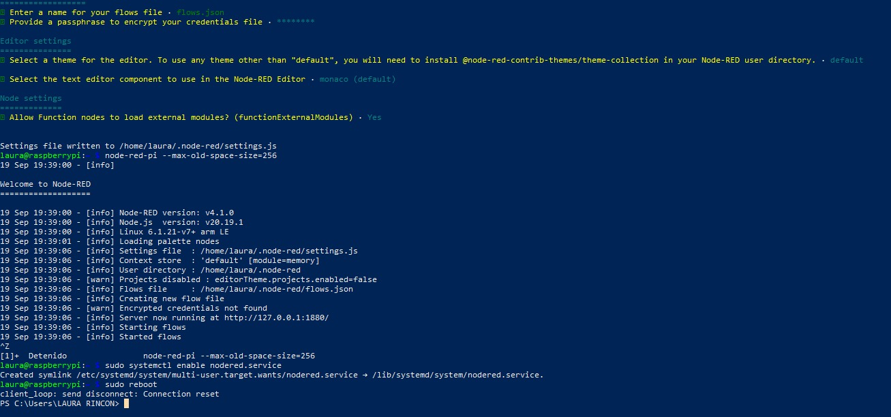
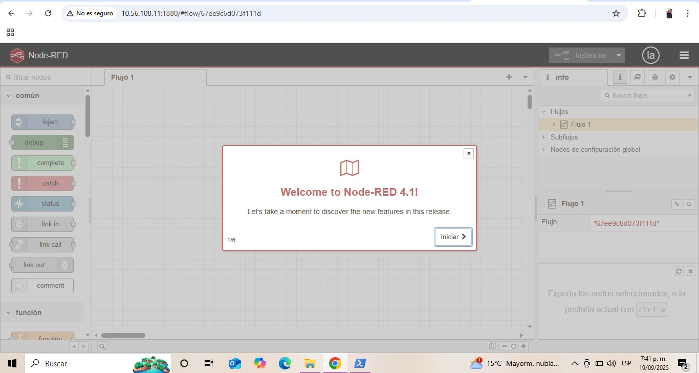
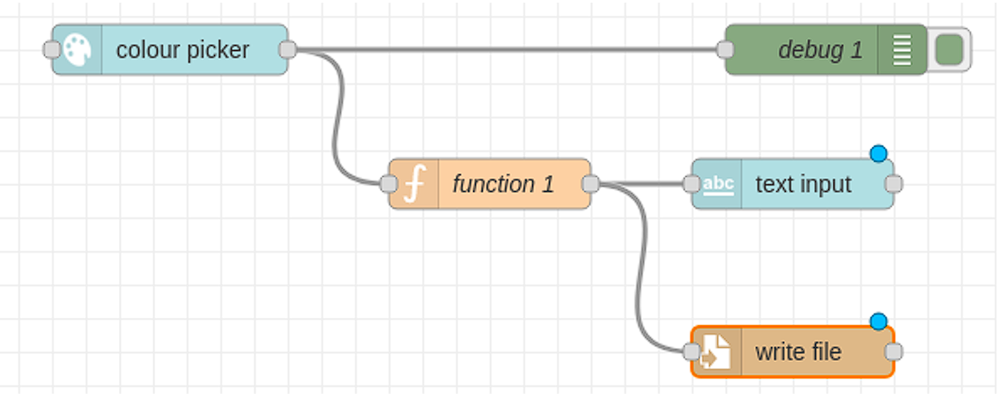

[](https://classroom.github.com/online_ide?assignment_repo_id=20745264&assignment_repo_type=AssignmentRepo)
# Lab04: Visualización de Datos en Raspberry Pi con Node-RED 

## Integrantes

- [Michael Handrety Fonseca Arana](https://github.com/MichaelJF50)  
- [Laura Daniela Rincón Pinilla](https://github.com/Laura03rincon)  

## Documentación

<!-- Incluir diagramas y adjuntar al repositorio, en una carpeta src, el flujo que crearon -->

En el presente laboratorio se realizó la conexión inalámbrica entre la Raspberry Pi, el equipo de cómputo local mediante SSH y la interfaz web de Node-RED

## Requisitos
- Raspberry Pi con Raspberry Pi OS.  
- Acceso SSH habilitado.  
- Node.js, npm y Node-RED instalados.  
- Python 3 instalado.  
- Conexión a la misma red local para acceder a la interfaz de Node-RED desde el navegador.  

### Marco teorico
**Node-red**: Node-RED es una herramienta de programación visual basada en Node.js que permite conectar dispositivos, APIs y servicios usando «nodos» que arrastras y encadenas en un editor tipo diagrama de flujo. 

Node-RED en una Raspberry Pi funciona como un servidor que corre sobre Node.js y se abre desde un navegador en la dirección (http://localhost:1880). Desde allí puedes usar un editor gráfico basado en bloques llamados nodos. Estos nodos se arrastran y conectan para crear flujos de datos que se ejecutan en tiempo real. Los nodos de entrada permiten leer información (por ejemplo, de los pines GPIO, MQTT o HTTP). Los nodos de proceso sirven para transformar los datos (hacer cálculos o aplicar lógica con funciones en JavaScript). Finalmente, los nodos de salida permiten mostrar o enviar la información, ya sea en un dashboard, a una base de datos o incluso activando otro pin GPIO.


- **Nodos de entrada**: leen datos (GPIO de la Pi, MQTT, HTTP, etc.).
- **Nodos de proceso**: transforman o procesan la información (funciones JavaScript, filtros, cálculos).
- **Nodos de salida**: envían los resultados a la pantalla, dashboard, GPIO, base de datos, correo, etc.
- **SSH (Secure Shell):** protocolo que permite conectarse de forma remota y segura a la Raspberry Pi.
- **Dashboard:** conjunto de nodos de Node-RED que generan una interfaz gráfica accesible desde el navegador.
- **systemd / systemctl:** sistema de inicialización y gestión de servicios en Linux, usado para ejecutar procesos en segundo plano.

### Desarrollo 
El primer paso consistió en establecer la conexión remota con la Raspberry Pi desde el computador mediante el protocolo SSH. Para ello, se utilizó el comando:

```bash
ssh laura@10.56.108.11
```

Donde laura corresponde al usuario configurado en la Raspberry Pi y 10.56.108.11 es la dirección IP asignada dentro de la red local. Una vez ingresada la contraseña, se habilitó la terminal remota para ejecutar todas las configuraciones necesarias.

Una vez dentro, se procedió a instalar Node-RED utilizando el script oficial recomendado por la comunidad. El comando ejecutado fue:

```bash
bash <(curl -sL https://raw.githubusercontent.com/node-red/linux-installers/master/deb/update-nodejs-and-nodered)
```
Al iniciar el proceso, el script realizó una serie de verificaciones y solicitó confirmaciones. En primer lugar, preguntó si se deseaba continuar con la instalación; se respondió afirmativamente escribiendo y y presionando Enter. Posteriormente, solicitó instalar nodos específicos para la Raspberry Pi, a lo cual también se respondió con y. Tras estas confirmaciones, comenzó la descarga e instalación de Node.js, Node-RED y las librerías necesarias. El proceso tomó varios minutos, mostrando en pantalla mensajes de progreso hasta finalizar con la notificación “All done.”.

Durante la instalación, aparecieron algunas preguntas de configuración inicial, que en la mayoría de los casos se resolvieron aceptando las opciones por defecto con la tecla Enter. Una vez finalizado, se inició Node-RED manualmente con el comando:

```bash
node-red-pi --max-old-space-size=256
```

El parámetro --max-old-space-size=256 limitó el uso de memoria a 256 MB, optimizando el rendimiento en la Raspberry Pi. Al finalizar la carga, se accedió desde un navegador en el computador con la dirección http://10.56.108.11:1880, confirmando que la interfaz de Node-RED estaba operativa.

Sin embargo, se identificó que Node-RED ocupaba la terminal en primer plano, impidiendo ejecutar otros comandos, y que al cerrar la sesión SSH el servicio se detenía. Para resolver esto, se configuró Node-RED como un servicio de systemd, habilitándolo con:

```bash
sudo systemctl enable nodered.service

sudo systemctl start nodered.service
```

Finalmente, se reinició la Raspberry Pi con:

```bash
sudo reboot
```

y se comprobó que el servicio de Node-RED iniciaba automáticamente en cada arranque, manteniéndose disponible siempre desde la URL http://10.56.108.11:1880.

Una vez asegurada la ejecución, se instaló el paquete Dashboard desde la opción Manage Palette → Install, buscando node-red-dashboard. Con este complemento, se habilitaron nodos para crear interfaces gráficas interactivas accesibles desde el navegador.

El primer flujo diseñado consistió en un selector de colores. En el editor de Node-RED, se creó una nueva pestaña de Dashboard llamada tab1, con un grupo denominado color. Se añadieron y conectaron los siguientes nodos:

- **Color picker**: permitía seleccionar un color en formato **RGB**.  
- **Text input**: mostraba los valores **RGB** correspondientes al color elegido.  
- **Debug**: verificaba en la consola de depuración los valores procesados.  
- **Function**: transformaba el mensaje para integrarlo con los demás nodos.  
- **File**: guardaba los datos en un archivo dentro de la **Raspberry Pi**. 

Al ejecutar el flujo y acceder a la URL http://10.506.108.11/ui, se visualizó la interfaz con el selector de colores. Cada vez que se elegía un color, los valores RGB se actualizaSban en el panel, se procesaban en el nodo Function y finalmente quedaban registrados en el archivo configurado en la ruta:

```bash
/home/LAURA RINCON/documents/test.txt
```
Desde la terminal SSH, se verificó la existencia del archivo mediante:

```bash
cd /home/LAURA RINCON/documents
ls
cat test.txt
```

Confirmando que los valores seleccionados desde el Dashboard se estaban almacenando correctamente. Además, se creó otra pestaña en el Dashboard llamada button, con un nodo botón que permitía enviar acciones adicionales al flujo, integrándose con el nodo Function y el nodo File.

De esta forma, el laboratorio no solo permitió instalar y ejecutar Node-RED en la Raspberry Pi, sino también construir un flujo completo que conectó nodos de entrada, procesamiento y salida, verificando en tiempo real la interacción entre la interfaz gráfica y los archivos locales de la Raspberry Pi.

### Dificultades  

Uno de los problemas fue con la interfaz del Dashboard: aunque el paquete node-red-dashboard aparecía como instalado, la interfaz gráfica no mostraba correctamente los nodos de control, en especial el selector de colores. Al acceder a la dirección http:/10.56.108.11:1880/ui, la pestaña se cargaba pero los elementos no aparecían. La solución fue reinstalar el paquete desde Manage palette → Install, lo que corrigió el error y permitió que la interfaz funcionara correctamente.

<p align="center">
  
</p>

Ejecución en primer plano: al iniciar Node-RED con node-red-pi --max-old-space-size=256, la terminal SSH quedaba ocupada y, si se cerraba, el servicio dejaba de estar disponible. Esto obligó a habilitar Node-RED como servicio en systemd con sudo systemctl enable nodered.service, asegurando que se ejecutara automáticamente en segundo plano. 


<p align="center">
  
</p>


### Términos técnicos aprendidos  

- **SSH (Secure Shell)**: protocolo que permite la conexión remota segura a la Raspberry Pi desde otro equipo. Ejemplo de uso: `ssh usuario@ip`.  
- **Script remoto con curl y bash**: comando que descarga y ejecuta automáticamente la instalación de Node-RED. Ejemplo: `bash <(curl -sL https://raw.githubusercontent.com/node-red/linux-installers/master/deb/update-nodejs-and-nodered)`.  
- **systemctl**: herramienta de Linux para gestionar servicios en segundo plano, como en `sudo systemctl enable nodered.service`.  
- **Dashboard**: conjunto de nodos en Node-RED que permiten generar interfaces gráficas interactivas accesibles desde el navegador.  

## Conclusiones  

El laboratorio permitió comprender cómo establecer una conexión remota con la Raspberry Pi y cómo instalar y configurar Node-RED como servicio en segundo plano. Además, se logró crear un flujo funcional con nodos de entrada, procesamiento y salida, verificando el almacenamiento de datos y su visualización en un dashboard. 

Se concluye que Node-RED es una herramienta poderosa para integrar hardware y software mediante flujos visuales, y que su ejecución en la Raspberry Pi lo convierte en una opción práctica para proyectos de monitoreo y control en tiempo real.  
<<<<<<< HEAD
=======

## Requisitos
- Raspberry Pi con Raspberry Pi OS.  
- Acceso SSH habilitado.  
- Node.js, npm y Node-RED instalados.  
- Python 3 instalado.  
- Conexión a la misma red local para acceder a la interfaz de Node-RED desde el navegador.  

### Marco teorico
**Node-red**: Node-RED es una herramienta de programación visual basada en Node.js que permite conectar dispositivos, APIs y servicios usando «nodos» que arrastras y encadenas en un editor tipo diagrama de flujo. 

Node-RED en una Raspberry Pi funciona como un servidor que corre sobre Node.js y se abre desde un navegador en la dirección (http://localhost:1880). Desde allí puedes usar un editor gráfico basado en bloques llamados nodos. Estos nodos se arrastran y conectan para crear flujos de datos que se ejecutan en tiempo real. Los nodos de entrada permiten leer información (por ejemplo, de los pines GPIO, MQTT o HTTP). Los nodos de proceso sirven para transformar los datos (hacer cálculos o aplicar lógica con funciones en JavaScript). Finalmente, los nodos de salida permiten mostrar o enviar la información, ya sea en un dashboard, a una base de datos o incluso activando otro pin GPIO.


- **Nodos de entrada**: leen datos (GPIO de la Pi, MQTT, HTTP, etc.).
- **Nodos de proceso**: transforman o procesan la información (funciones JavaScript, filtros, cálculos).
- **Nodos de salida**: envían los resultados a la pantalla, dashboard, GPIO, base de datos, correo, etc.
- **SSH (Secure Shell):** protocolo que permite conectarse de forma remota y segura a la Raspberry Pi.
- **Dashboard:** conjunto de nodos de Node-RED que generan una interfaz gráfica accesible desde el navegador.
- **systemd / systemctl:** sistema de inicialización y gestión de servicios en Linux, usado para ejecutar procesos en segundo plano.

### Desarrollo 
El primer paso consistió en establecer la conexión remota con la Raspberry Pi desde el computador mediante el protocolo SSH. Para ello, se utilizó el comando:

```bash
ssh laura@10.56.108.11
```

Donde laura corresponde al usuario configurado en la Raspberry Pi y 10.56.108.11 es la dirección IP asignada dentro de la red local. Una vez ingresada la contraseña, se habilitó la terminal remota para ejecutar todas las configuraciones necesarias.

Una vez dentro, se procedió a instalar Node-RED utilizando el script oficial recomendado por la comunidad. El comando ejecutado fue:

```bash
bash <(curl -sL https://raw.githubusercontent.com/node-red/linux-installers/master/deb/update-nodejs-and-nodered)
```
Al iniciar el proceso, el script realizó una serie de verificaciones y solicitó confirmaciones. En primer lugar, preguntó si se deseaba continuar con la instalación; se respondió afirmativamente escribiendo y y presionando Enter. Posteriormente, solicitó instalar nodos específicos para la Raspberry Pi, a lo cual también se respondió con y. Tras estas confirmaciones, comenzó la descarga e instalación de Node.js, Node-RED y las librerías necesarias. El proceso tomó varios minutos, mostrando en pantalla mensajes de progreso hasta finalizar con la notificación “All done.”.

Durante la instalación, aparecieron algunas preguntas de configuración inicial, que en la mayoría de los casos se resolvieron aceptando las opciones por defecto con la tecla Enter. Una vez finalizado, se inició Node-RED manualmente con el comando:

```bash
node-red-pi --max-old-space-size=256
```

El parámetro --max-old-space-size=256 limitó el uso de memoria a 256 MB, optimizando el rendimiento en la Raspberry Pi. Al finalizar la carga, se accedió desde un navegador en el computador con la dirección http://10.56.108.11:1880, confirmando que la interfaz de Node-RED estaba operativa.

Sin embargo, se identificó que Node-RED ocupaba la terminal en primer plano, impidiendo ejecutar otros comandos, y que al cerrar la sesión SSH el servicio se detenía. Para resolver esto, se configuró Node-RED como un servicio de systemd, habilitándolo con:

```bash
sudo systemctl enable nodered.service

sudo systemctl start nodered.service
```

Finalmente, se reinició la Raspberry Pi con:

```bash
sudo reboot
```

y se comprobó que el servicio de Node-RED iniciaba automáticamente en cada arranque, manteniéndose disponible siempre desde la URL http://10.56.108.11:1880.

Una vez asegurada la ejecución, se instaló el paquete Dashboard desde la opción Manage Palette → Install, buscando node-red-dashboard. Con este complemento, se habilitaron nodos para crear interfaces gráficas interactivas accesibles desde el navegador.

El primer flujo diseñado consistió en un selector de colores. En el editor de Node-RED, se creó una nueva pestaña de Dashboard llamada tab1, con un grupo denominado color. Se añadieron y conectaron los siguientes nodos:

- **Color picker**: permitía seleccionar un color en formato **RGB**.  
- **Text input**: mostraba los valores **RGB** correspondientes al color elegido.  
- **Debug**: verificaba en la consola de depuración los valores procesados.  
- **Function**: transformaba el mensaje para integrarlo con los demás nodos.  
- **File**: guardaba los datos en un archivo dentro de la **Raspberry Pi**. 

Al ejecutar el flujo y acceder a la URL http://10.506.108.11/ui, se visualizó la interfaz con el selector de colores. Cada vez que se elegía un color, los valores RGB se actualizaSban en el panel, se procesaban en el nodo Function y finalmente quedaban registrados en el archivo configurado en la ruta:

```bash
/home/LAURA RINCON/documents/test.txt
```
Desde la terminal SSH, se verificó la existencia del archivo mediante:

```bash
cd /home/LAURA RINCON/documents
ls
cat test.txt
```

Confirmando que los valores seleccionados desde el Dashboard se estaban almacenando correctamente. Además, se creó otra pestaña en el Dashboard llamada button, con un nodo botón que permitía enviar acciones adicionales al flujo, integrándose con el nodo Function y el nodo File.

<p align="center">
  
</p>

De esta forma, el laboratorio no solo permitió instalar y ejecutar Node-RED en la Raspberry Pi, sino también construir un flujo completo que conectó nodos de entrada, procesamiento y salida, verificando en tiempo real la interacción entre la interfaz gráfica y los archivos locales de la Raspberry Pi.

### Dificultades  

Uno de los problemas fue con la interfaz del Dashboard: aunque el paquete node-red-dashboard aparecía como instalado, la interfaz gráfica no mostraba correctamente los nodos de control, en especial el selector de colores. Al acceder a la dirección http:/10.56.108.11:1880/ui, la pestaña se cargaba pero los elementos no aparecían. La solución fue reinstalar el paquete desde Manage palette → Install, lo que corrigió el error y permitió que la interfaz funcionara correctamente.

Ejecución en primer plano: al iniciar Node-RED con node-red-pi --max-old-space-size=256, la terminal SSH quedaba ocupada y, si se cerraba, el servicio dejaba de estar disponible. Esto obligó a habilitar Node-RED como servicio en systemd con sudo systemctl enable nodered.service, asegurando que se ejecutara automáticamente en segundo plano. 

### Términos técnicos aprendidos  

- **SSH (Secure Shell)**: protocolo que permite la conexión remota segura a la Raspberry Pi desde otro equipo. Ejemplo de uso: `ssh usuario@ip`.  
- **Script remoto con curl y bash**: comando que descarga y ejecuta automáticamente la instalación de Node-RED. Ejemplo: `bash <(curl -sL https://raw.githubusercontent.com/node-red/linux-installers/master/deb/update-nodejs-and-nodered)`.  
- **systemctl**: herramienta de Linux para gestionar servicios en segundo plano, como en `sudo systemctl enable nodered.service`.  
- **Dashboard**: conjunto de nodos en Node-RED que permiten generar interfaces gráficas interactivas accesibles desde el navegador.  

## Conclusiones  

El laboratorio permitió comprender cómo establecer una conexión remota con la Raspberry Pi y cómo instalar y configurar Node-RED como servicio en segundo plano. Además, se logró crear un flujo funcional con nodos de entrada, procesamiento y salida, verificando el almacenamiento de datos y su visualización en un dashboard.  

Se concluye que Node-RED es una herramienta poderosa para integrar hardware y software mediante flujos visuales, y que su ejecución en la Raspberry Pi lo convierte en una opción práctica para proyectos de monitoreo y control en tiempo real.  

>>>>>>> 7b6d49b97d601e1aaa506265cb12f1dedd893edb
=======
>>>>>>> 0f081b423b6b431def84d7b62627c22cec97bdc5
